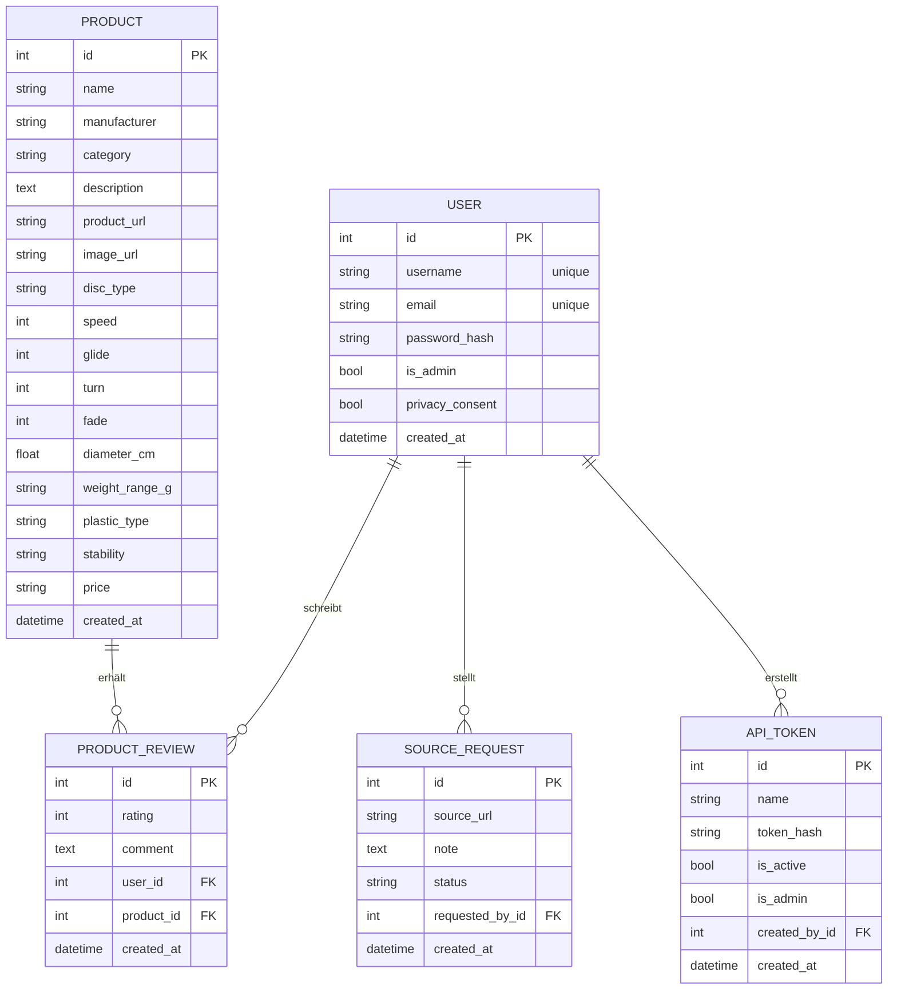
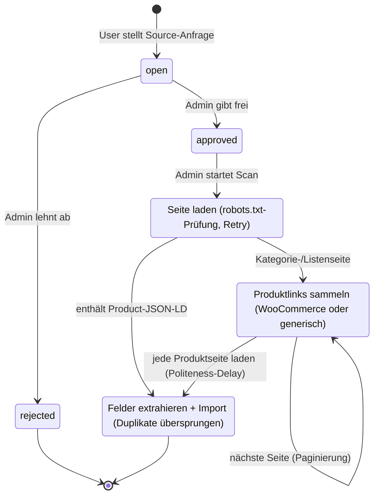
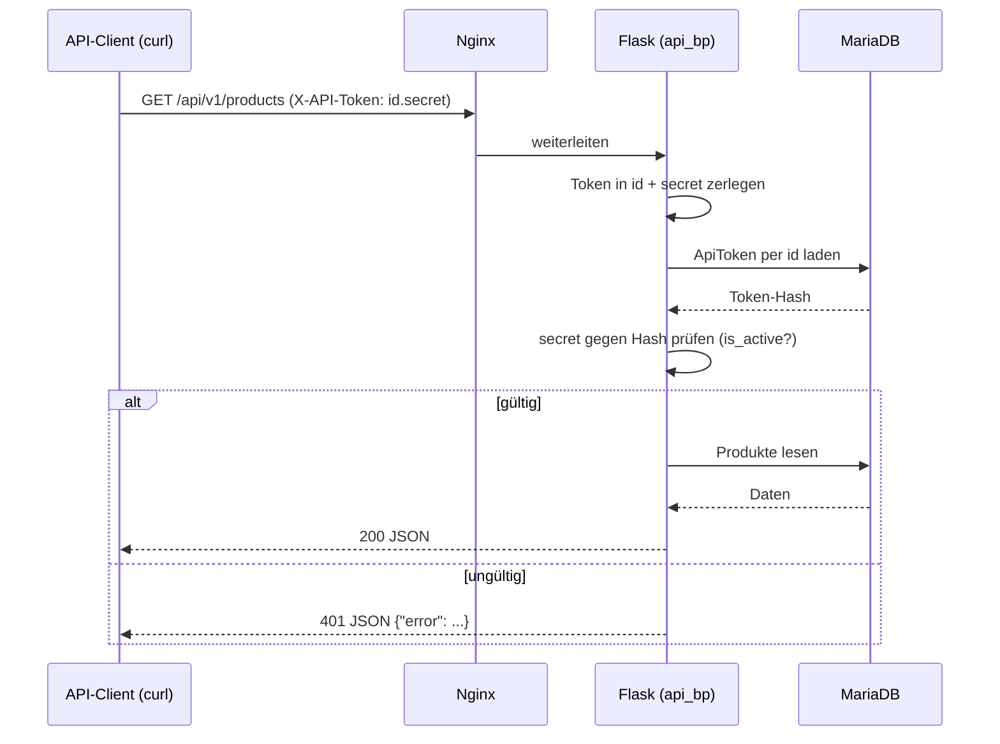
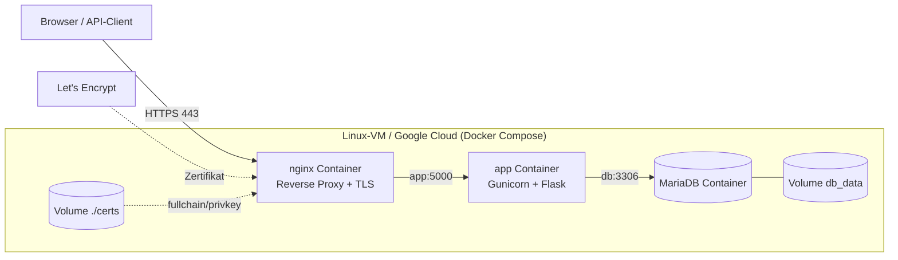

# Praxisarbeit DBWE.TA1A.PA – FlightDeck DG Hub

**Modul:** DBWE.TA1A.PA – Datenbanken und Webentwicklung
**Studiengang:** HFINFA / HFINFP, 3. Studienjahr
**Verfasser:** Jonas Zauner
**Examinator:** _<Name eintragen>_
**Abgabedatum:** 05.06.2026

**Fach:** Datenbanken und Webentwicklung (DBWE)
**Anwendung:** FlightDeck DG Hub – Disc-Golf-Wissensplattform
**Technologien:** Python 3.12, Flask, MariaDB, Gunicorn, Nginx, Docker Compose
**Repository:** https://github.com/harpf/FlightDeck-DG-Hub
**Live-URL:** https://lab10.ifalabs.org _(HTTPS/443; vertrauenswürdiges **Let's-Encrypt**-Zertifikat, siehe Anhang / `docs/DEPLOYMENT.md`)_

> Dieses Dokument ist als Markdown verfasst und kann mit `pandoc` o. ä. nach PDF
> konvertiert werden (Mermaid-Diagramme werden z. B. von Typora, VS Code oder
> `pandoc` mit `mermaid-filter` gerendert). Siehe `docs/README.md`.

---

## 1 Management Summary

FlightDeck DG Hub ist eine Webanwendung, mit der eine Disc-Golf-Community
Ausrüstung (Discs, Bags, Körbe, Zubehör) gemeinsam erfassen, suchen und bewerten
kann. Benutzer registrieren sich mit Benutzername, E-Mail und Passwort, legen
Produkte mit den typischen Disc-Golf-Flugwerten (Speed, Glide, Turn, Fade) an
und bewerten sie. Jede Disc erhält aus ihren Flugwerten automatisch ein
**serverseitig gerendertes Flugkurven-Diagramm** (Inline-SVG). Zusätzlich können
Benutzer **Quellen vorschlagen**, aus denen ein Administrator nach Freigabe
Produktdaten automatisiert importiert – ein **eigenentwickelter Web-Crawler**,
der strukturierte Daten (schema.org-JSON-LD) ausliest, Kategorieseiten bis zu den
Einzelprodukten folgt (inkl. Paginierung) und dabei `robots.txt` samt
Crawl-Delay respektiert.

**Plattform / Infrastruktur:** Die Anwendung ist als containerisierte
3-Schichten-Architektur umgesetzt (Nginx → Gunicorn/Flask → MariaDB) und wird
per **Docker Compose** betrieben. Das Deployment erfolgt auf einer Linux-VM
(Google Cloud, `lab10.ifalabs.org`) und ist per **HTTPS mit vertrauenswürdigem
Let's-Encrypt-Zertifikat** öffentlich erreichbar.

**Grösster Mehrwert:** Eine gemeinschaftlich gepflegte, durchsuchbare
Wissensbasis inklusive **maschinenlesbarem REST-API mit lesendem und (über
Admin-Token) schreibendem Zugriff**, über das die Anwendung ohne Browser
(z. B. per `curl`/Postman) vollständig gesteuert werden kann.

**Grösstes Risiko:** Die automatisierte Datenübernahme aus Fremdquellen
(Crawling) ist rechtlich und technisch heikel; sie ist deshalb auf
**admin-freigegebene** Quellen begrenzt, prüft vorab die `robots.txt` und
crawlt bewusst langsam (Politeness-Delay).

**Was das Management wissen sollte:** Die Architektur ist bewusst einfach und
kostengünstig (ein Host, Open-Source-Stack, keine Lizenzkosten). Sie ist für
kleine bis mittlere Last ausgelegt; horizontale Skalierung ist vorbereitet,
aber noch nicht aktiviert (siehe Kapitel 7). Offener Punkt für den Betrieb: die
**automatische Zertifikatserneuerung** ist dokumentiert, aber noch nicht als
Cronjob aktiviert (Zertifikat 90 Tage gültig).

---

## 2 Anwendung

### 2.1 Wichtigste Anforderungen (Soll/Ist)

| # | Anforderung (Aufgabenstellung) | Umsetzung |
| - | --- | --- |
| A1 | Interaktive Weboberfläche (Eingabe, Aktion, Ergebnis) | Produktliste mit Suche/Filter, Produkterfassung, Bewertungen, Source-Anfragen |
| A2 | Benutzerkonten mit Passwort, Registrierung mit eindeutigem Benutzernamen + E-Mail | `auth`-Blueprint, `User`-Modell mit `unique`-Constraints, Passwort-Hash |
| A3 | Applikationsspezifische Daten in relationaler DB | `Product`, `ProductReview`, `SourceRequest`, `ApiToken` in MariaDB |
| A4 | Eigene Geschäftslogik | Suche/Filter, Review-Upsert, **Web-Crawler** (JSON-LD, Paginierung, robots.txt/Politeness), Flugkurven-Diagramm (SVG) |
| A5 | Lesender Zugriff über RESTful Web-API, Auth ohne Browser | `/api/v1/*` mit `X-API-Token`-Header; zusätzlich **schreibender** Zugriff über Admin-Token |
| A6 | DB MySQL/MariaDB/PostgreSQL | MariaDB 11.4 |
| A7 | Python ≥ 3.9 | Python 3.12 (Container-Image) |
| A8 | Flask + Erweiterungen | Flask, Flask-SQLAlchemy, Flask-Login, Flask-WTF, Flask-Migrate |
| A9 | Gunicorn (ggf. mit Nginx) | Gunicorn hinter Nginx Reverse Proxy |
| A10 | Source Code auf GitHub | https://github.com/harpf/FlightDeck-DG-Hub |
| A11 | Tests dokumentiert | pytest-Suite (96 Tests) + Testprotokoll (Kap. 2.6) |
| A12 | Öffentliche Erreichbarkeit über HTTPS | Let's-Encrypt-Zertifikat auf `lab10.ifalabs.org` (Port 443) |

### 2.2 Funktionalität und Bedienung (User Manual)

**Rollen**

- **Anonym:** Produkte ansehen, suchen und filtern.
- **User (registriert):** zusätzlich Produkte anlegen, Produkte bewerten,
  Source-Anfragen senden.
- **Admin:** zusätzlich Source-Anfragen moderieren (freigeben/ablehnen), Quellen
  scannen, API-Tokens verwalten sowie **alle registrierten Benutzer einsehen und
  deaktivieren/aktivieren**.

**Typische Abläufe**

1. **Registrieren:** Navbar → *Registrieren* → Benutzername, E-Mail, Passwort
   (min. 10 Zeichen), Datenschutz-Einwilligung → Absenden.
2. **Anmelden:** Navbar → *Login*.
3. **Produkte suchen/filtern:** Startseite – Freitextsuche (Name/Hersteller) und
   Kategorie-Filter.
4. **Produkt anlegen:** *Produkt anlegen* → Felder inkl. Flugwerte (Speed 1–15,
   Glide 1–8, Turn −6…2, Fade 0–6) → Speichern.
5. **Produktdetail ansehen:** Detailseite zeigt Produktbild, technische Daten
   (Disc-Typ, Preis, Gewicht, Stability), die Flugwerte **und ein automatisch aus
   Turn/Fade erzeugtes Flugkurven-Diagramm** (Inline-SVG, ohne JavaScript).
6. **Bewerten:** Produktdetailseite → Bewertung (1–5) + Kommentar. Pro Benutzer
   und Produkt ist genau **eine** Bewertung möglich (weitere überschreiben sie).
7. **Source anfragen:** *Source anfragen* → URL + Notiz. Der Admin sieht die
   Anfrage im Dashboard.
8. **Admin-Dashboard (`/admin`):** Source-Anfragen freigeben/ablehnen,
   freigegebene Quelle scannen (Crawler importiert Produkte inkl. Bild, Flugwerte,
   Preis, Gewicht), API-Tokens erstellen/deaktivieren – wahlweise als **Read-Token**
   oder **Admin-Token** (Schreibrechte, Checkbox „Admin").

### 2.3 API-Schnittstelle

REST-API für ausgewählte Anwendungsdaten. Authentifizierung über einen
**statischen API-Token** im Header `X-API-Token: <id>.<secret>` (von einem Admin
im Dashboard erstellt). Kein Browser/Session nötig. **Lesende** Endpunkte
funktionieren mit jedem aktiven Token; **schreibende** Endpunkte erfordern einen
als *Admin* markierten Token (sonst `403`).

**Lesend**

| Methode | Endpunkt | Auth | Beschreibung |
| --- | --- | --- | --- |
| `GET` | `/api/v1/health` | – | Liveness-Check |
| `GET` | `/api/v1/products` | Token | Produktliste (`?q=`, `?category=`) |
| `GET` | `/api/v1/products/<id>` | Token | Einzelprodukt inkl. Reviews |
| `GET` | `/api/v1/full` | Token | Vollexport (Produkte + Reviews + Source-Requests) |
| `GET` | `/api/docs` | – | Interaktive Swagger-UI (Browser) |
| `GET` | `/api/openapi.json` | – | OpenAPI-3.0-Spezifikation (maschinenlesbar) |

**Schreibend (Admin-Token)**

| Methode | Endpunkt | Beschreibung |
| --- | --- | --- |
| `POST` | `/api/v1/products` | Produkt anlegen |
| `PATCH` | `/api/v1/products/<id>` | Produkt aktualisieren |
| `DELETE` | `/api/v1/products/<id>` | Produkt löschen |
| `POST` | `/api/v1/sources` | Source-Request anlegen |
| `PATCH` | `/api/v1/sources/<id>` | Source-Status ändern (open/approved/rejected) |
| `POST` | `/api/v1/sources/<id>/scan` | Quelle scannen/importieren → `{found, created, duplicates}` |
| `POST` | `/api/v1/products/<id>/reviews` | Bewertung anlegen/aktualisieren |

Beispiele (vertrauenswürdiges Zertifikat – kein `-k` nötig):

```
curl https://lab10.ifalabs.org/api/v1/health
curl -H "X-API-Token: 3.kJ8..." https://lab10.ifalabs.org/api/v1/products
curl -H "X-API-Token: 3.kJ8..." "https://lab10.ifalabs.org/api/v1/products?q=destroyer"

# Schreibend (Admin-Token):
curl -X POST https://lab10.ifalabs.org/api/v1/products \
  -H "X-API-Token: 4.adminSecret..." -H "Content-Type: application/json" \
  -d '{"name":"Wraith","manufacturer":"Innova","speed":11,"glide":5,"turn":-1,"fade":3}'
```

Fehlerfälle: fehlender/ungültiger Token → `401`; Read-Token auf Schreib-Endpunkt
→ `403`; unbekanntes Produkt → `404`; Scan auf nicht-freigegebene Quelle → `409`
(jeweils als JSON). Details: `scripts/API_Readme.md`, interaktiv unter `/api/docs`.

### 2.4 Architektur

#### 2.4.1 Datenmodell (ERD)



Kurzbeschreibung: Ein **User** kann viele **ProductReviews**, **SourceRequests**
und **ApiTokens** besitzen. Ein **Product** hat viele **ProductReviews**. Die
Kombination (`user_id`, `product_id`) in `ProductReview` ist über einen
`UniqueConstraint` eindeutig (eine Bewertung pro Benutzer/Produkt). Passwörter
und API-Secrets werden ausschliesslich als Hash gespeichert. `Product` trägt
neben den Flugwerten die vom Crawler befüllten Felder (`image_url`, `disc_type`,
`price`, `weight_range_g`, `stability` …). `ApiToken.is_admin` unterscheidet
lesende von schreibenden Tokens (Autorisierung des Schreib-API).

#### 2.4.2 Wichtigster Ablauf: Source-Anfrage → Scan (Zustandsdiagramm)



Nur **freigegebene** Quellen dürfen gescannt werden. Vor jedem Abruf wird die
`robots.txt` der Zielseite geprüft (`is_scraping_allowed`) und ein
Crawl-Delay/Politeness-Delay eingehalten; fehlgeschlagene Requests werden einmal
wiederholt. Ist die Quelle eine **Einzelproduktseite**, werden die Daten direkt
aus dem `application/ld+json`-`Product`-Markup gelesen; ist sie eine
**Kategorie-/Listenseite**, sammelt der Crawler die Produktlinks (primär
WooCommerce-Kacheln, sonst generische „Produktlink"-Heuristik), folgt der
**Paginierung** und lädt jede Produktseite einzeln. Extrahiert werden Name,
Hersteller, Disc-Typ, Beschreibung, Bild, Flugwerte, Preis, Gewicht und
Stability. Bereits vorhandene Einträge (gleicher Name + Hersteller) werden
übersprungen. Sicherheitsgrenzen: max. Seiten/Produkte pro Scan.

#### 2.4.3 API-Authentifizierung (Sequenzdiagramm)



Für **schreibende** Endpunkte gilt zusätzlich: nach erfolgreicher Token-Prüfung
wird das Flag `is_admin` des Tokens kontrolliert. Ein Read-Token erhält `403`
(„Admin-scoped API token required"), nur ein Admin-Token darf schreiben. Die
gemeinsame Scan-/Review-Logik liegt in einer Service-Schicht (`app/services.py`),
die sowohl von der Weboberfläche als auch vom API genutzt wird – so kann das
Verhalten nicht auseinanderdriften (DRY).

#### 2.4.4 Bereitstellung (Deployment-Diagramm)



Drei Container (`nginx`, `app`, `db`) in einem Docker-Compose-Netz. Nur Nginx
veröffentlicht Ports nach aussen: **443 (HTTPS)** mit einem vertrauenswürdigen
**Let's-Encrypt-Zertifikat** (`certbot`, HTTP-01-Challenge) sowie 80, das dauerhaft
auf HTTPS umleitet. Die Zertifikatsdateien liegen im Volume `./certs`. Der
Anwendungszustand liegt ausschliesslich im Volume `db_data`, sodass App-Container
ohne Datenverlust ersetzt werden können. Ausstellung/Erneuerung: siehe
`docs/DEPLOYMENT.md`, Abschnitt 8.

### 2.5 Zusätzlich verwendete Technologien (mit Quellen)

| Technologie | Zweck | Quelle |
| --- | --- | --- |
| Docker / Docker Compose | Containerisierung, reproduzierbares Deployment | https://docs.docker.com/compose/ |
| Bootstrap 5 | Frontend-Styling (CDN) | https://getbootstrap.com/ |
| Standardbibliothek `urllib.robotparser` | robots.txt-Prüfung + Crawl-delay beim Crawling | https://docs.python.org/3/library/urllib.robotparser.html |
| `application/ld+json` (Schema.org Product) | strukturierte Produktdaten beim Import | https://schema.org/Product |
| `markupsafe` | sicheres Escaping beim serverseitig gerenderten Flugkurven-SVG | https://markupsafe.palletsprojects.com/ |
| Let's Encrypt / `certbot` | vertrauenswürdiges TLS-Zertifikat (HTTP-01) | https://certbot.eff.org/ |
| Inline-SVG (W3C) | Flugkurven-Diagramm ohne JS-Bibliothek | https://developer.mozilla.org/docs/Web/SVG |

**Eigenentwickelte Funktionalität (Kernstück der Arbeit):**

- **Web-Crawler** (`app/scanner.py`): liest schema.org-JSON-LD, folgt
  WooCommerce-/generischen Listenseiten samt Paginierung zu den Produktseiten,
  extrahiert Flugwerte/Preis/Gewicht/Stability/Bild, respektiert `robots.txt` +
  Crawl-delay, mit Politeness-Pause, Retry und Mengenlimits. Trennung von reiner
  Parselogik (testbar, ohne Netz) und I/O.
- **Flugkurven-Diagramm** (`app/flightchart.py`): erzeugt aus Turn/Fade
  serverseitig ein Inline-SVG der typischen Disc-Golf-Flugkurve (kein JavaScript,
  keine externe Bibliothek).

Begründung Docker (über den Unterricht hinaus): einheitliche Laufzeitumgebung
für app/db/nginx, einfache Bereitstellung auf der Lab-VM, klare Trennung der
Komponenten. Vorteil: Reproduzierbarkeit; Nachteil: zusätzliche Abstraktions-
und Betriebsebene.

### 2.6 Testprotokoll

Automatisierte Tests: `pytest` (**96 Tests, alle grün**). Ausführung:
`pip install -r requirements-dev.txt && pytest`. Untenstehend eine Auswahl von
12 repräsentativen Testfällen quer über alle Bereiche.

| # | Testfall | Erwartetes Ergebnis | Tatsächliches Ergebnis | Art |
| - | --- | --- | --- | --- |
| T1 | Registrierung mit bereits vergebenem Benutzernamen | kein zweiter Account | wie erwartet | auto (`test_register_rejects_duplicate_username`) |
| T2 | Registrierung ohne Datenschutz-Einwilligung | Account wird **nicht** angelegt | wie erwartet | auto (`test_register_requires_privacy_consent`) |
| T3 | Produkt anlegen ohne Login | Redirect zu `/auth/login` | wie erwartet | auto (`test_create_product_requires_login`) |
| T4 | Suche grenzt Produkte ein | Nicht-Treffer wird nicht angezeigt | wie erwartet | auto (`test_home_search_filters_products`) |
| T5 | API (lesend) ohne Token | HTTP 401 (JSON) | wie erwartet | auto (`test_products_requires_token`) |
| T6 | API (lesend) mit gültigem Token | HTTP 200 + Produktliste | wie erwartet | auto (`test_products_list_with_token`) |
| T7 | Schreib-API mit Read-Token abgelehnt | HTTP 403 | wie erwartet | auto (`test_write_rejected_for_read_only_token`) |
| T8 | Produkt über API anlegen (Admin-Token) | HTTP 201 + Produkt-JSON | wie erwartet | auto (`test_create_product`) |
| T9 | Scan einer nicht-freigegebenen Quelle über API | HTTP 409 | wie erwartet | auto (`test_scan_non_approved_source_is_409`) |
| T10 | Crawler folgt Listen-Paginierung zu Produktseiten | alle Produkte über mehrere Seiten importiert | wie erwartet | auto (`test_scan_crawls_listing_and_follows_pagination`) |
| T11 | Crawler extrahiert Preis/Gewicht/Stability | Felder korrekt befüllt | wie erwartet | auto (`test_extract_products_populates_price_weight_stability`) |
| T12 | Flugkurven-SVG escaped Eingaben (XSS-Schutz) | kein `<script>` im Output | wie erwartet | auto (`test_render_flight_svg_escapes_caption_values`) |
| T13 | End-to-End gegen Live-Deployment (HTTPS) | `curl` ohne `-k`: health 200, ohne Token 401, POST 201 | wie erwartet (am Live-System geprüft) | manuell |

Hinweis gemäss Aufgabenstellung: Es kommt nicht darauf an, dass alle Tests
erfolgreich sind, sondern dass sie definiert und durchgeführt wurden. T13 wurde
nach dem Deployment gegen `https://lab10.ifalabs.org` mit gültigem
Let's-Encrypt-Zertifikat ausgeführt.

---

## 3 Reflexion: Wartbarkeit, Skalierbarkeit, Verfügbarkeit

**Wartbarkeit.** Die App ist in Flask-Blueprints (`main`, `auth`, `products`,
`admin`, `api`) getrennt; Datenzugriff erfolgt über das SQLAlchemy-ORM statt
über Roh-SQL. Die JSON-Ausgabe des API ist in zentralen Serializern gebündelt,
die gemeinsame Scan-/Review-Geschäftslogik in einer **Service-Schicht**
(`app/services.py`), die Web und API teilen – so gibt es genau eine Umsetzung
pro Datenform bzw. Ablauf (keine Drift, DRY). Der Crawler trennt reine
Parselogik von Netz-I/O und ist dadurch ohne Netzwerk testbar. **96
automatisierte Tests** (inkl. eines geführten Security-Reviews mit anschliessender
Härtung des Schreib-API) sichern die Kernfunktionen ab. *Vorteil:* schnelle,
sichere Änderungen. *Nachteil:* das ORM verdeckt teils das tatsächliche SQL; bei
Performance-Themen ist `EXPLAIN`-Analyse nötig.

**Skalierbarkeit.** Kurzfristig vertikal (mehr Gunicorn-Worker/Threads, mehr
DB-Ressourcen). Mittelfristig horizontal: Der `app`-Container ist zustandslos
und kann hinter Nginx repliziert werden; die Sessions müssten dann serverseitig
(z. B. Redis) ausgelagert werden. *Vorteil:* klarer Pfad ohne Architektur-
Bruch. *Nachteil:* horizontale Skalierung ist vorbereitet, aber noch nicht
aktiv (Session-Store, Load-Balancer fehlen).

**Verfügbarkeit.** Alle Container laufen mit `restart: unless-stopped`; der
Zustand liegt ausschliesslich im Volume `db_data`, sodass App-Container ohne
Datenverlust ersetzt werden können. Ein öffentlicher Health-Endpoint
(`/api/v1/health`) ermöglicht Monitoring; der Zugriff erfolgt über HTTPS mit
vertrauenswürdigem Let's-Encrypt-Zertifikat. *Offener Punkt:* Die automatische
**Zertifikatserneuerung** (90-Tage-Gültigkeit) ist dokumentiert
(`docs/DEPLOYMENT.md` §8.4), aber noch nicht als Cronjob aktiviert. *Nachteil:*
Single-Host ohne Redundanz; fällt die VM aus, ist der Dienst offline. Für höhere
Verfügbarkeit wären mehrere Hosts, ein externer DB-Dienst und
Healthchecks/Alerting nötig (siehe `docs/ARCHITEKTUR.md`, Roadmap).

---

## Anhang

- **Repository:** https://github.com/harpf/FlightDeck-DG-Hub (öffentlich, lesend)
- **Live-URL:** https://lab10.ifalabs.org (HTTPS/443, vertrauenswürdiges
  Let's-Encrypt-Zertifikat – kein `-k` nötig)
- **Admin-Login:** Benutzer `admin`, Passwort `<beim Deployment generiert>`
  _(gesetzt über `BOOTSTRAP_ADMIN_PASSWORD` in der `.env`; sichere Übergabe an
  den Examinator, nicht im Repository)_
- **API-Token (Beispiel):** `<id>.<secret>` _(im Admin-Dashboard erzeugen –
  Read-Token für lesend, „Admin"-Checkbox für schreibend, siehe Kap. 2.3)_
- **Interaktive API-Doku:** https://lab10.ifalabs.org/api/docs (Swagger-UI)
- **Architektur-Detail:** `docs/ARCHITEKTUR.md`
- **Deployment inkl. TLS/Let's Encrypt:** `docs/DEPLOYMENT.md`
- **API-Doku:** `scripts/API_Readme.md`

