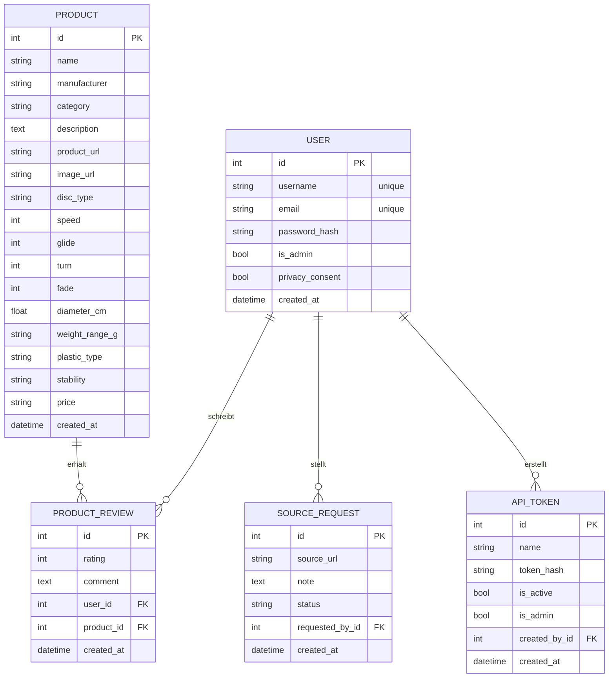
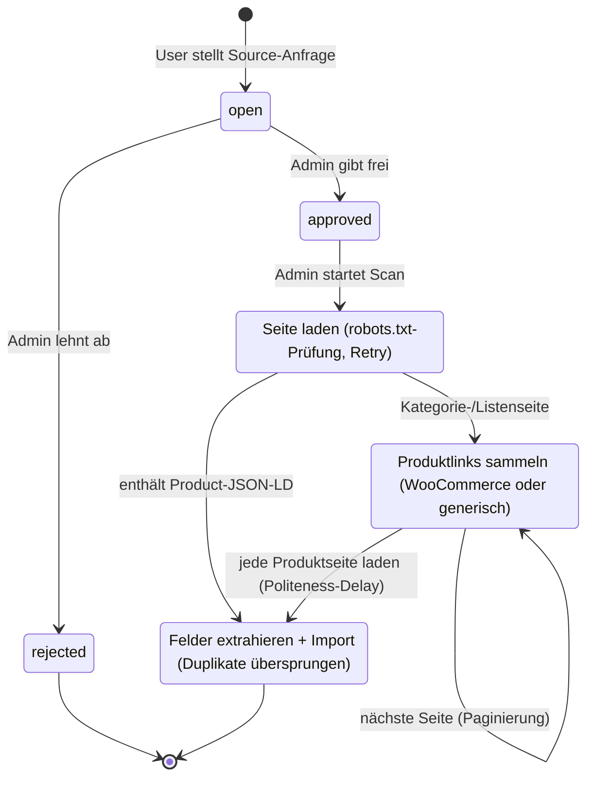
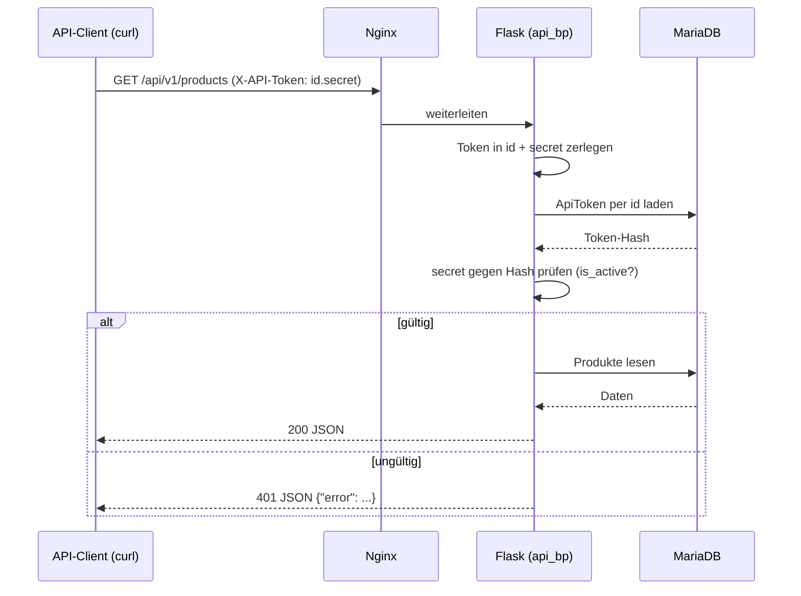
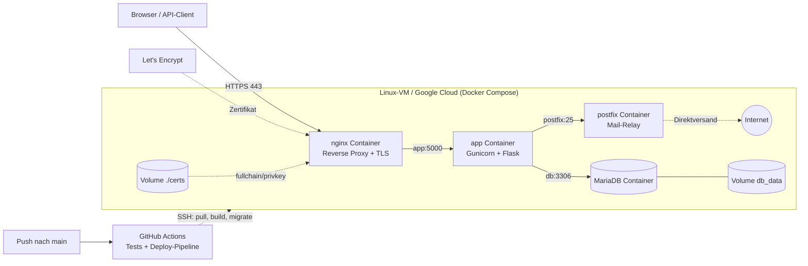

<div class="titlepage">

# FlightDeck DG Hub

## Disc-Golf-Wissensplattform mit Flask, MariaDB und automatisiertem Produkt-Crawler

**Praxisarbeit der IFA Höhere Fachschule der Digitalen Wirtschaft**

Modul DBWE.TA1A.PA – Datenbanken und Webentwicklung
Studiengang HFINFA / HFINFP, 3. Studienjahr

<br>

| | |
| --- | --- |
| **Verfasser** | Jonas Zauner |
| **Adresse** | _‹Strasse, PLZ Ort eintragen›_ |
| **E-Mail** | _‹E-Mail eintragen›_ |
| **Telefon** | _‹Telefonnummer eintragen›_ |
| **Klasse** | _‹Klasse eintragen›_ |
| **Effektives Abgabedatum** | _‹TT.MM.JJJJ eintragen›_ |
| **Examinator/in** | _‹Name eintragen›_ |
| **Qualifikationsreglement** | _‹Version eintragen›_ |
| **Leitfaden schriftliche Arbeiten** | Version 2.1 |
| **CI-/Dokumentvorlage** | keine verwendet |

<br>

**Repository:** https://github.com/harpf/FlightDeck-DG-Hub
**Live-URL:** https://lab10.ifalabs.org (HTTPS/443, vertrauenswürdiges Let's-Encrypt-Zertifikat)

</div>

<div class="pagebreak"></div>

## Management Summary

FlightDeck DG Hub ist eine Webanwendung, mit der eine Disc-Golf-Community
Ausrüstung (Discs, Bags, Körbe, Zubehör) gemeinsam erfassen, suchen und bewerten
kann. Benutzer registrieren sich mit Benutzername, E-Mail und Passwort, legen
Produkte mit den typischen Disc-Golf-Flugwerten (Speed, Glide, Turn, Fade) an
und bewerten sie. Jede Disc erhält aus ihren Flugwerten automatisch ein
**serverseitig gerendertes Flugkurven-Diagramm** (Inline-SVG). Zusätzlich können
Benutzer **Quellen vorschlagen**, aus denen ein Administrator nach Freigabe
Produktdaten automatisiert importiert – ein **eigenentwickelter Web-Crawler**,
der strukturierte Daten (schema.org-JSON-LD) ausliest, Kategorieseiten bis zu den
Einzelprodukten folgt (inkl. Paginierung) und dabei `robots.txt` samt
Crawl-Delay respektiert.

**Plattform / Infrastruktur:** Die Anwendung ist als containerisierte
3-Schichten-Architektur umgesetzt (Nginx → Gunicorn/Flask → MariaDB) und wird
per **Docker Compose** betrieben. Das Deployment erfolgt auf einer Linux-VM
(Google Cloud, `lab10.ifalabs.org`) und ist per **HTTPS mit vertrauenswürdigem
Let's-Encrypt-Zertifikat** öffentlich erreichbar.

**Grösster Mehrwert:** Eine gemeinschaftlich gepflegte, durchsuchbare
Wissensbasis inklusive **maschinenlesbarem REST-API mit lesendem und (über
Admin-Token) schreibendem Zugriff**, über das die Anwendung ohne Browser
(z. B. per `curl`/Postman) vollständig gesteuert werden kann.

**Grösstes Risiko:** Die automatisierte Datenübernahme aus Fremdquellen
(Crawling) ist rechtlich und technisch heikel; sie ist deshalb auf
**admin-freigegebene** Quellen begrenzt, prüft vorab die `robots.txt` und
crawlt bewusst langsam (Politeness-Delay).

**Was das Management wissen sollte:** Die Architektur ist bewusst einfach und
kostengünstig (ein Host, Open-Source-Stack, keine Lizenzkosten). Sie ist für
kleine bis mittlere Last ausgelegt; horizontale Skalierung ist vorbereitet,
aber noch nicht aktiviert (siehe Kapitel 7). Offener Punkt für den Betrieb: die
**automatische Zertifikatserneuerung** ist dokumentiert, aber noch nicht als
Cronjob aktiviert (Zertifikat 90 Tage gültig).

---

<div class="pagebreak"></div>

## Inhaltsverzeichnis

[[TOC]]

<div class="pagebreak"></div>

## 1 Einleitung

Diese Praxisarbeit dokumentiert Konzeption, Umsetzung und Betrieb der Webanwendung
**FlightDeck DG Hub**, einer Wissensplattform für den Disc-Golf-Sport. Ziel ist eine
lauffähige, über das Internet erreichbare Flask-Anwendung mit relationaler Datenbank,
einer selbst entworfenen Fachfunktionalität sowie einem browserlosen REST-API – gemäss
der Aufgabenstellung DBWE.TA1A.PA.

Kapitel 2 beschreibt die Anwendung (Anforderungen, Bedienung, API und Architektur mit
Diagrammen) sowie das Testprotokoll. Kapitel 3 reflektiert die gewählte Lösung hinsichtlich
Wartbarkeit, Skalierbarkeit und Verfügbarkeit. Die Verzeichnisse und die
Eigenständigkeitserklärung schliessen die Arbeit ab. Der Quellcode ist vollständig auf
GitHub veröffentlicht (siehe Quellenverzeichnis), die Anwendung läuft unter
`https://lab10.ifalabs.org`.

## 2 Anwendung

### 2.1 Wichtigste Anforderungen (Soll/Ist)

| # | Anforderung (Aufgabenstellung) | Umsetzung |
| - | --- | --- |
| A1 | Interaktive Weboberfläche (Eingabe, Aktion, Ergebnis) | Produktliste mit Suche/Filter, Produkterfassung, Bewertungen, Source-Anfragen |
| A2 | Benutzerkonten mit Passwort, Registrierung mit eindeutigem Benutzernamen + E-Mail | `auth`-Blueprint, `User`-Modell mit `unique`-Constraints, Passwort-Hash |
| A3 | Applikationsspezifische Daten in relationaler DB | `Product`, `ProductReview`, `SourceRequest`, `ApiToken` in MariaDB |
| A4 | Eigene Geschäftslogik | Suche/Filter, Review-Upsert, **Web-Crawler** (JSON-LD, Paginierung, robots.txt/Politeness), Flugkurven-Diagramm (SVG) |
| A5 | Lesender Zugriff über RESTful Web-API, Auth ohne Browser | `/api/v1/*` mit `X-API-Token`-Header; zusätzlich **schreibender** Zugriff über Admin-Token |
| A6 | DB MySQL/MariaDB/PostgreSQL | MariaDB 11.4 |
| A7 | Python ≥ 3.9 | Python 3.12 (Container-Image) |
| A8 | Flask + Erweiterungen | Flask, Flask-SQLAlchemy, Flask-Login, Flask-WTF, Flask-Migrate |
| A9 | Gunicorn (ggf. mit Nginx) | Gunicorn hinter Nginx Reverse Proxy |
| A10 | Source Code auf GitHub | https://github.com/harpf/FlightDeck-DG-Hub |
| A11 | Tests dokumentiert | pytest-Suite (96 Tests) + Testprotokoll (Kap. 2.6) |
| A12 | Öffentliche Erreichbarkeit über HTTPS | Let's-Encrypt-Zertifikat auf `lab10.ifalabs.org` (Port 443) |

*Tabelle 1: Wichtigste Anforderungen (Soll/Ist). Eigene Darstellung.*

### 2.2 Funktionalität und Bedienung (User Manual)

**Rollen**

- **Anonym:** Produkte ansehen, suchen und filtern.
- **User (registriert):** zusätzlich Produkte anlegen, Produkte bewerten,
  Source-Anfragen senden.
- **Admin:** zusätzlich Source-Anfragen moderieren (freigeben/ablehnen), Quellen
  scannen, API-Tokens verwalten, **alle registrierten Benutzer einsehen und
  deaktivieren/aktivieren** sowie eine **Testmail versenden** (Kontrolle des
  Mailversands, unabhängig von Registrierung/Passwort-Reset).

**Typische Abläufe**

1. **Registrieren:** Navbar → *Registrieren* → Benutzername, E-Mail, Passwort
   (min. 10 Zeichen), Datenschutz-Einwilligung → Absenden. Der Account ist erst
   nach Klick auf den Bestätigungslink in der zugeschickten E-Mail
   login-fähig; „Bestätigungsmail erneut senden" auf der Login-Seite deckt den
   Fall ab, dass die Mail nicht ankam.
2. **Anmelden:** Navbar → *Login*. „Passwort vergessen?" führt über eine
   zeitlich begrenzte, signierte Mail-Link zum Setzen eines neuen Passworts.
3. **Produkte suchen/filtern:** Startseite – Freitextsuche (Name/Hersteller) und
   Kategorie-Filter.
4. **Produkt anlegen:** *Produkt anlegen* → Felder inkl. Flugwerte (Speed 1–15,
   Glide 1–8, Turn −6…2, Fade 0–6) → Speichern.
5. **Produktdetail ansehen:** Detailseite zeigt Produktbild, technische Daten
   (Disc-Typ, Preis, Gewicht, Stability), die Flugwerte **und ein automatisch aus
   Turn/Fade erzeugtes Flugkurven-Diagramm** (Inline-SVG, ohne JavaScript).
6. **Bewerten:** Produktdetailseite → Bewertung (1–5) + Kommentar. Pro Benutzer
   und Produkt ist genau **eine** Bewertung möglich (weitere überschreiben sie).
7. **Source anfragen:** *Source anfragen* → URL + Notiz. Der Admin sieht die
   Anfrage im Dashboard.
8. **Admin-Dashboard (`/admin`):** Source-Anfragen freigeben/ablehnen,
   freigegebene Quelle scannen (Crawler importiert Produkte inkl. Bild, Flugwerte,
   Preis, Gewicht), API-Tokens erstellen/deaktivieren – wahlweise als **Read-Token**
   oder **Admin-Token** (Schreibrechte, Checkbox „Admin").

### 2.3 API-Schnittstelle

REST-API für ausgewählte Anwendungsdaten. Authentifizierung über einen
**statischen API-Token** im Header `X-API-Token: <id>.<secret>` (von einem Admin
im Dashboard erstellt). Kein Browser/Session nötig. **Lesende** Endpunkte
funktionieren mit jedem aktiven Token; **schreibende** Endpunkte erfordern einen
als *Admin* markierten Token (sonst `403`).

**Lesend**

| Methode | Endpunkt | Auth | Beschreibung |
| --- | --- | --- | --- |
| `GET` | `/api/v1/health` | – | Liveness-Check |
| `GET` | `/api/v1/products` | Token | Produktliste (`?q=`, `?category=`) |
| `GET` | `/api/v1/products/<id>` | Token | Einzelprodukt inkl. Reviews |
| `GET` | `/api/v1/full` | Token | Vollexport (Produkte + Reviews + Source-Requests) |
| `GET` | `/api/docs` | – | Interaktive Swagger-UI (Browser) |
| `GET` | `/api/openapi.json` | – | OpenAPI-3.0-Spezifikation (maschinenlesbar) |

**Schreibend (Admin-Token)**

| Methode | Endpunkt | Beschreibung |
| --- | --- | --- |
| `POST` | `/api/v1/products` | Produkt anlegen |
| `PATCH` | `/api/v1/products/<id>` | Produkt aktualisieren |
| `DELETE` | `/api/v1/products/<id>` | Produkt löschen |
| `POST` | `/api/v1/sources` | Source-Request anlegen |
| `PATCH` | `/api/v1/sources/<id>` | Source-Status ändern (open/approved/rejected) |
| `POST` | `/api/v1/sources/<id>/scan` | Quelle scannen/importieren → `{found, created, duplicates}` |
| `POST` | `/api/v1/products/<id>/reviews` | Bewertung anlegen/aktualisieren |

*Tabelle 2: REST-API-Endpunkte (lesend/schreibend). Eigene Darstellung.*

Beispiele (vertrauenswürdiges Zertifikat – kein `-k` nötig):

```
curl https://lab10.ifalabs.org/api/v1/health
curl -H "X-API-Token: 3.kJ8..." https://lab10.ifalabs.org/api/v1/products
curl -H "X-API-Token: 3.kJ8..." "https://lab10.ifalabs.org/api/v1/products?q=destroyer"

# Schreibend (Admin-Token):
curl -X POST https://lab10.ifalabs.org/api/v1/products \
  -H "X-API-Token: 4.adminSecret..." -H "Content-Type: application/json" \
  -d '{"name":"Wraith","manufacturer":"Innova","speed":11,"glide":5,"turn":-1,"fade":3}'
```

Fehlerfälle: fehlender/ungültiger Token → `401`; Read-Token auf Schreib-Endpunkt
→ `403`; unbekanntes Produkt → `404`; Scan auf nicht-freigegebene Quelle → `409`
(jeweils als JSON). Details: `scripts/API_Readme.md`, interaktiv unter `/api/docs`.

### 2.4 Architektur

#### 2.4.1 Datenmodell (ERD)



*Abbildung 1: Datenmodell der Anwendung (ERD). Eigene Darstellung.*

Kurzbeschreibung: Ein **User** kann viele **ProductReviews**, **SourceRequests**
und **ApiTokens** besitzen. Ein **Product** hat viele **ProductReviews**. Die
Kombination (`user_id`, `product_id`) in `ProductReview` ist über einen
`UniqueConstraint` eindeutig (eine Bewertung pro Benutzer/Produkt). Passwörter
und API-Secrets werden ausschliesslich als Hash gespeichert. `Product` trägt
neben den Flugwerten die vom Crawler befüllten Felder (`image_url`, `disc_type`,
`price`, `weight_range_g`, `stability` …). `ApiToken.is_admin` unterscheidet
lesende von schreibenden Tokens (Autorisierung des Schreib-API).

#### 2.4.2 Wichtigster Ablauf: Source-Anfrage → Scan (Zustandsdiagramm)



*Abbildung 2: Zustandsdiagramm „Source-Anfrage → Scan". Eigene Darstellung.*

Nur **freigegebene** Quellen dürfen gescannt werden. Vor jedem Abruf wird die
`robots.txt` der Zielseite geprüft (`is_scraping_allowed`) und ein
Crawl-Delay/Politeness-Delay eingehalten; fehlgeschlagene Requests werden einmal
wiederholt. Ist die Quelle eine **Einzelproduktseite**, werden die Daten direkt
aus dem `application/ld+json`-`Product`-Markup gelesen; ist sie eine
**Kategorie-/Listenseite**, sammelt der Crawler die Produktlinks (primär
WooCommerce-Kacheln, sonst generische „Produktlink"-Heuristik), folgt der
**Paginierung** und lädt jede Produktseite einzeln. Extrahiert werden Name,
Hersteller, Disc-Typ, Beschreibung, Bild, Flugwerte, Preis, Gewicht und
Stability. Bereits vorhandene Einträge (gleicher Name + Hersteller) werden
übersprungen. Sicherheitsgrenzen: max. Seiten/Produkte pro Scan.

#### 2.4.3 API-Authentifizierung (Sequenzdiagramm)



*Abbildung 3: Sequenzdiagramm der API-Authentifizierung. Eigene Darstellung.*

Für **schreibende** Endpunkte gilt zusätzlich: nach erfolgreicher Token-Prüfung
wird das Flag `is_admin` des Tokens kontrolliert. Ein Read-Token erhält `403`
(„Admin-scoped API token required"), nur ein Admin-Token darf schreiben. Die
gemeinsame Scan-/Review-Logik liegt in einer Service-Schicht (`app/services.py`),
die sowohl von der Weboberfläche als auch vom API genutzt wird – so kann das
Verhalten nicht auseinanderdriften (DRY).

#### 2.4.4 Bereitstellung (Deployment-Diagramm)



*Abbildung 4: Deployment-/Komponenten-Diagramm. Eigene Darstellung.*

Drei Container (`nginx`, `app`, `db`) in einem Docker-Compose-Netz. Nur Nginx
veröffentlicht Ports nach aussen: **443 (HTTPS)** mit einem vertrauenswürdigen
**Let's-Encrypt-Zertifikat** (`certbot`, HTTP-01-Challenge) sowie 80, das dauerhaft
auf HTTPS umleitet. Die Zertifikatsdateien liegen im Volume `./certs`. Der
Anwendungszustand liegt ausschliesslich im Volume `db_data`, sodass App-Container
ohne Datenverlust ersetzt werden können. Ausstellung/Erneuerung: siehe
`docs/DEPLOYMENT.md`, Abschnitt 8.

**CI/CD-Pipeline (GitHub Actions):** Ein Workflow (`.github/workflows/deploy.yml`)
automatisiert die bisher manuellen Deployment-Schritte. Job 1 (`test`) installiert
die Abhängigkeiten und führt die pytest-Suite aus; nur bei grünem Ergebnis läuft
Job 2 (`deploy`). Dieser baut per SSH-Agent-Action eine Verbindung mit einem
dedizierten, ausschliesslich für die Pipeline erzeugten Ed25519-Schlüssel auf
(hinterlegt als GitHub-Secret, kein Passwort im Klartext) und führt auf der VM
`git pull`, `docker compose up -d --build`, `flask db upgrade` sowie einen
Health-Check gegen `/api/v1/health` aus. Dafür wurde `Flask-Migrate`/Alembic
nachträglich auf dem bestehenden Schema initialisiert (leere Baseline-Revision,
per `flask db stamp head` als aktuell markiert), sodass künftige
Schemaänderungen über `flask db migrate`/`upgrade` statt manueller
`ALTER TABLE`-Anweisungen laufen. Aktuell ist der Workflow bewusst nur manuell
auslösbar (`workflow_dispatch`); der automatische Trigger bei Push auf `main`
ist im Workflow bereits vorbereitet, aber auskommentiert, bis die Pipeline sich
im Praxisbetrieb bewährt hat. Details: `docs/DEPLOYMENT.md`, Abschnitt 10.

**Mailversand (Postfix):** Ein vierter Container (`postfix`, Image
`boky/postfix`) übernimmt den Versand transaktionaler Mails
(E-Mail-Bestätigung nach Registrierung, Passwort-Reset, Admin-Testmail). Er
ist ausschliesslich im internen Docker-Netz erreichbar (`app` → `postfix:25`,
kein veröffentlichter Port, sonst offener Relay) und versendet direkt
(HTTP/SMTP-Port 25 ausgehend auf der GCP-VM offen, geprüft) ohne
Relay/Smarthost — für die Praxisarbeit/Korrekturphase bewusst ohne SPF/DKIM,
da kein Zugriff auf die DNS-Zone besteht; Mails können dadurch im
Spam-Ordner landen. `Flask-Mail` sendet, `itsdangerous` erzeugt die zeitlich
begrenzten, signierten Bestätigungs-/Reset-Tokens. Ein Fehlschlag beim Senden
(z. B. Postfix nicht erreichbar) wird abgefangen und geloggt statt die
anfragende Aktion mit 500 abzubrechen. Der Versand wurde end-to-end gegen
eine echte externe Mailbox verifiziert: Postfix lieferte direkt an deren
Mailserver aus, dieser bestätigte mit `250 Ok` (angenommen zur Zustellung).

Beim Einbau von Postfix zeigte sich ein latenter Bug im bestehenden
nginx-Setup: `proxy_pass http://app:5000` löst den Hostnamen einmalig beim
Start auf und cached die IP; wird der `app`-Container neu erstellt (jeder
Deploy), ändert sich seine Docker-interne IP, während das seit Wochen
laufende nginx die alte IP weiterverwendet → `502 Bad Gateway`. Bisher blieb
das unbemerkt, weil Docker die freigewordene IP meist zufällig wiederverwendet
hat; der zusätzliche `postfix`-Container verschob die IP-Vergabe und deckte es
auf. Behoben mit dem Standardmuster `resolver 127.0.0.11 valid=10s;` plus
Variable in `proxy_pass`, damit nginx pro Request neu auflöst.

### 2.5 Zusätzlich verwendete Technologien (mit Quellen)

| Technologie | Zweck | Quelle |
| --- | --- | --- |
| Docker / Docker Compose | Containerisierung, reproduzierbares Deployment | https://docs.docker.com/compose/ |
| Bootstrap 5 | Frontend-Styling (CDN) | https://getbootstrap.com/ |
| Standardbibliothek `urllib.robotparser` | robots.txt-Prüfung + Crawl-delay beim Crawling | https://docs.python.org/3/library/urllib.robotparser.html |
| `application/ld+json` (Schema.org Product) | strukturierte Produktdaten beim Import | https://schema.org/Product |
| `markupsafe` | sicheres Escaping beim serverseitig gerenderten Flugkurven-SVG | https://markupsafe.palletsprojects.com/ |
| Let's Encrypt / `certbot` | vertrauenswürdiges TLS-Zertifikat (HTTP-01) | https://certbot.eff.org/ |
| Inline-SVG (W3C) | Flugkurven-Diagramm ohne JS-Bibliothek | https://developer.mozilla.org/docs/Web/SVG |
| GitHub Actions | CI/CD-Pipeline: Tests + automatisiertes Deployment | https://docs.github.com/actions |
| Flask-Migrate / Alembic | Versionierte Schemamigrationen statt manueller `ALTER TABLE` | https://flask-migrate.readthedocs.io/ |
| Postfix (`boky/postfix`-Image) | Mailversand (Bestätigung, Passwort-Reset, Testmail) | https://www.postfix.org/ |
| Flask-Mail | SMTP-Anbindung der Flask-App an Postfix | https://flask-mail.readthedocs.io/ |
| itsdangerous | Signierte, zeitlich begrenzte Bestätigungs-/Reset-Tokens | https://itsdangerous.palletsprojects.com/ |

*Tabelle 3: Zusätzlich verwendete Technologien. Eigene Darstellung.*

**Eigenentwickelte Funktionalität (Kernstück der Arbeit):**

- **Web-Crawler** (`app/scanner.py`): liest schema.org-JSON-LD, folgt
  WooCommerce-/generischen Listenseiten samt Paginierung zu den Produktseiten,
  extrahiert Flugwerte/Preis/Gewicht/Stability/Bild, respektiert `robots.txt` +
  Crawl-delay, mit Politeness-Pause, Retry und Mengenlimits. Trennung von reiner
  Parselogik (testbar, ohne Netz) und I/O.
- **Flugkurven-Diagramm** (`app/flightchart.py`): erzeugt aus Turn/Fade
  serverseitig ein Inline-SVG der typischen Disc-Golf-Flugkurve (kein JavaScript,
  keine externe Bibliothek).

Begründung Docker (über den Unterricht hinaus): einheitliche Laufzeitumgebung
für app/db/nginx, einfache Bereitstellung auf der Lab-VM, klare Trennung der
Komponenten. Vorteil: Reproduzierbarkeit; Nachteil: zusätzliche Abstraktions-
und Betriebsebene.

### 2.6 Testprotokoll

Automatisierte Tests: `pytest` (**96 Tests, alle grün**). Ausführung:
`pip install -r requirements-dev.txt && pytest`. Untenstehend eine Auswahl von
12 repräsentativen Testfällen quer über alle Bereiche.

| # | Testfall | Erwartetes Ergebnis | Tatsächliches Ergebnis | Art |
| - | --- | --- | --- | --- |
| T1 | Registrierung mit bereits vergebenem Benutzernamen | kein zweiter Account | wie erwartet | auto (`test_register_rejects_duplicate_username`) |
| T2 | Registrierung ohne Datenschutz-Einwilligung | Account wird **nicht** angelegt | wie erwartet | auto (`test_register_requires_privacy_consent`) |
| T3 | Produkt anlegen ohne Login | Redirect zu `/auth/login` | wie erwartet | auto (`test_create_product_requires_login`) |
| T4 | Suche grenzt Produkte ein | Nicht-Treffer wird nicht angezeigt | wie erwartet | auto (`test_home_search_filters_products`) |
| T5 | API (lesend) ohne Token | HTTP 401 (JSON) | wie erwartet | auto (`test_products_requires_token`) |
| T6 | API (lesend) mit gültigem Token | HTTP 200 + Produktliste | wie erwartet | auto (`test_products_list_with_token`) |
| T7 | Schreib-API mit Read-Token abgelehnt | HTTP 403 | wie erwartet | auto (`test_write_rejected_for_read_only_token`) |
| T8 | Produkt über API anlegen (Admin-Token) | HTTP 201 + Produkt-JSON | wie erwartet | auto (`test_create_product`) |
| T9 | Scan einer nicht-freigegebenen Quelle über API | HTTP 409 | wie erwartet | auto (`test_scan_non_approved_source_is_409`) |
| T10 | Crawler folgt Listen-Paginierung zu Produktseiten | alle Produkte über mehrere Seiten importiert | wie erwartet | auto (`test_scan_crawls_listing_and_follows_pagination`) |
| T11 | Crawler extrahiert Preis/Gewicht/Stability | Felder korrekt befüllt | wie erwartet | auto (`test_extract_products_populates_price_weight_stability`) |
| T12 | Flugkurven-SVG escaped Eingaben (XSS-Schutz) | kein `<script>` im Output | wie erwartet | auto (`test_render_flight_svg_escapes_caption_values`) |
| T13 | End-to-End gegen Live-Deployment (HTTPS) | `curl` ohne `-k`: health 200, ohne Token 401, POST 201 | wie erwartet (am Live-System geprüft) | manuell |

*Tabelle 4: Testprotokoll (Auswahl von 13 aus 96 Tests). Eigene Darstellung.*

Hinweis gemäss Aufgabenstellung: Es kommt nicht darauf an, dass alle Tests
erfolgreich sind, sondern dass sie definiert und durchgeführt wurden. T13 wurde
nach dem Deployment gegen `https://lab10.ifalabs.org` mit gültigem
Let's-Encrypt-Zertifikat ausgeführt.

---

## 3 Reflexion: Wartbarkeit, Skalierbarkeit, Verfügbarkeit

**Wartbarkeit.** Die App ist in Flask-Blueprints (`main`, `auth`, `products`,
`admin`, `api`) getrennt; Datenzugriff erfolgt über das SQLAlchemy-ORM statt
über Roh-SQL. Die JSON-Ausgabe des API ist in zentralen Serializern gebündelt,
die gemeinsame Scan-/Review-Geschäftslogik in einer **Service-Schicht**
(`app/services.py`), die Web und API teilen – so gibt es genau eine Umsetzung
pro Datenform bzw. Ablauf (keine Drift, DRY). Der Crawler trennt reine
Parselogik von Netz-I/O und ist dadurch ohne Netzwerk testbar. **96
automatisierte Tests** (inkl. eines geführten Security-Reviews mit anschliessender
Härtung des Schreib-API) sichern die Kernfunktionen ab. *Vorteil:* schnelle,
sichere Änderungen. *Nachteil:* das ORM verdeckt teils das tatsächliche SQL; bei
Performance-Themen ist `EXPLAIN`-Analyse nötig.

**Skalierbarkeit.** Kurzfristig vertikal (mehr Gunicorn-Worker/Threads, mehr
DB-Ressourcen). Mittelfristig horizontal: Der `app`-Container ist zustandslos
und kann hinter Nginx repliziert werden; die Sessions müssten dann serverseitig
(z. B. Redis) ausgelagert werden. *Vorteil:* klarer Pfad ohne Architektur-
Bruch. *Nachteil:* horizontale Skalierung ist vorbereitet, aber noch nicht
aktiv (Session-Store, Load-Balancer fehlen).

**Verfügbarkeit.** Alle Container laufen mit `restart: unless-stopped`; der
Zustand liegt ausschliesslich im Volume `db_data`, sodass App-Container ohne
Datenverlust ersetzt werden können. Ein öffentlicher Health-Endpoint
(`/api/v1/health`) ermöglicht Monitoring; der Zugriff erfolgt über HTTPS mit
vertrauenswürdigem Let's-Encrypt-Zertifikat. *Offener Punkt:* Die automatische
**Zertifikatserneuerung** (90-Tage-Gültigkeit) ist dokumentiert
(`docs/DEPLOYMENT.md` §8.4), aber noch nicht als Cronjob aktiviert. *Nachteil:*
Single-Host ohne Redundanz; fällt die VM aus, ist der Dienst offline. Für höhere
Verfügbarkeit wären mehrere Hosts, ein externer DB-Dienst und
Healthchecks/Alerting nötig (siehe `docs/ARCHITEKTUR.md`, Roadmap).

---

<div class="pagebreak"></div>

## 4 Abkürzungsverzeichnis

| Abkürzung | Bedeutung |
| --- | --- |
| API | Application Programming Interface |
| CSP | Content Security Policy |
| CSRF | Cross-Site Request Forgery |
| DB | Datenbank |
| ERD | Entity-Relationship-Diagramm |
| HTTP(S) | Hypertext Transfer Protocol (Secure) |
| JSON | JavaScript Object Notation |
| JSON-LD | JSON for Linking Data (strukturierte Webdaten) |
| ORM | Object-Relational Mapping |
| REST | Representational State Transfer |
| SGTF | Speed, Glide, Turn, Fade (Disc-Flugwerte) |
| SVG | Scalable Vector Graphics |
| TLS | Transport Layer Security |
| UI | User Interface |
| VM | Virtual Machine |

## 5 Glossar

| Begriff | Erklärung |
| --- | --- |
| Disc Golf | Präzisionssportart, bei der Wurfscheiben (Discs) in möglichst wenigen Würfen in einen Zielkorb gespielt werden. |
| Flugwerte (Speed/Glide/Turn/Fade) | Vier Kennzahlen, die das Flugverhalten einer Disc beschreiben (Geschwindigkeit, Gleit­fähigkeit, Anfangs- und Endkurve). |
| Crawler / Web-Scraping | Automatisiertes Abrufen und Auslesen von Webseiten, um strukturierte Daten zu gewinnen. |
| robots.txt | Datei, mit der eine Website Crawlern mitteilt, welche Pfade abgerufen werden dürfen und wie langsam (Crawl-delay). |
| JSON-LD / schema.org | Standard, um maschinenlesbare Daten (z. B. `Product`) in Webseiten einzubetten. |
| Docker Compose | Werkzeug, um mehrere Container (App, DB, Nginx) gemeinsam zu definieren und zu betreiben. |
| Gunicorn | Produktions-WSGI-Server, der die Flask-Anwendung ausführt. |
| Reverse Proxy | Vorgelagerter Webserver (hier Nginx), der Anfragen entgegennimmt, TLS terminiert und weiterleitet. |
| Let's Encrypt | Zertifizierungsstelle, die kostenlose, vertrauenswürdige TLS-Zertifikate ausstellt. |
| Upsert | Kombinierte Operation „einfügen oder aktualisieren", falls ein Datensatz bereits existiert. |

## 6 Abbildungsverzeichnis

- Abbildung 1: Datenmodell der Anwendung (ERD) — Kapitel 2.4.1
- Abbildung 2: Zustandsdiagramm „Source-Anfrage → Scan" — Kapitel 2.4.2
- Abbildung 3: Sequenzdiagramm der API-Authentifizierung — Kapitel 2.4.3
- Abbildung 4: Deployment-/Komponenten-Diagramm — Kapitel 2.4.4

## 7 Tabellenverzeichnis

- Tabelle 1: Wichtigste Anforderungen (Soll/Ist) — Kapitel 2.1
- Tabelle 2: REST-API-Endpunkte (lesend/schreibend) — Kapitel 2.3
- Tabelle 3: Zusätzlich verwendete Technologien — Kapitel 2.5
- Tabelle 4: Testprotokoll (Auswahl) — Kapitel 2.6

## 8 Quellenverzeichnis

Bootstrap (o. J.). *Bootstrap 5 – Documentation*. Abgerufen am 19. Juni 2026 von https://getbootstrap.com/

Docker Inc. (o. J.). *Docker Compose documentation*. Abgerufen am 19. Juni 2026 von https://docs.docker.com/compose/

Electronic Frontier Foundation (o. J.). *Certbot*. Abgerufen am 19. Juni 2026 von https://certbot.eff.org/

GitHub, Inc. (o. J.). *GitHub Actions Documentation*. Abgerufen am 14. August 2026 von https://docs.github.com/actions

Grinberg, M. (o. J.). *Flask-Mail Documentation*. Abgerufen am 15. August 2026 von https://flask-mail.readthedocs.io/

Grinberg, M. (o. J.). *Flask-Migrate Documentation*. Abgerufen am 14. August 2026 von https://flask-migrate.readthedocs.io/

Let's Encrypt (o. J.). *How It Works*. Abgerufen am 19. Juni 2026 von https://letsencrypt.org/how-it-works/

Pallets (o. J.). *ItsDangerous Documentation*. Abgerufen am 15. August 2026 von https://itsdangerous.palletsprojects.com/

Postfix (o. J.). *Postfix Documentation*. Abgerufen am 15. August 2026 von https://www.postfix.org/

MDN Web Docs (o. J.). *SVG: Scalable Vector Graphics*. Abgerufen am 19. Juni 2026 von https://developer.mozilla.org/docs/Web/SVG

Pallets (o. J.). *MarkupSafe – Documentation*. Abgerufen am 19. Juni 2026 von https://markupsafe.palletsprojects.com/

Python Software Foundation (o. J.). *urllib.robotparser – Parser for robots.txt*. Abgerufen am 19. Juni 2026 von https://docs.python.org/3/library/urllib.robotparser.html

Schema.org (o. J.). *Product*. Abgerufen am 19. Juni 2026 von https://schema.org/Product

Zauner, J. (2026). *FlightDeck DG Hub* [Quellcode-Repository]. GitHub. Abgerufen am 19. Juni 2026 von https://github.com/harpf/FlightDeck-DG-Hub

<div class="pagebreak"></div>

## Anhang A: Zugang und Betrieb

- **Repository:** https://github.com/harpf/FlightDeck-DG-Hub (öffentlich, lesend)
- **Live-URL:** https://lab10.ifalabs.org (HTTPS/443, vertrauenswürdiges
  Let's-Encrypt-Zertifikat – kein `-k` nötig)
- **Admin-Login:** Benutzer `admin`, Passwort `‹beim Deployment generiert›`
  _(gesetzt über `BOOTSTRAP_ADMIN_PASSWORD` in der `.env`; sichere Übergabe an
  die Examinatorin/den Examinator, nicht im Repository)_
- **API-Token (Beispiel):** `‹id›.‹secret›` _(im Admin-Dashboard erzeugen –
  Read-Token für lesend, „Admin"-Checkbox für schreibend, siehe Kapitel 2.3)_
- **Interaktive API-Doku:** https://lab10.ifalabs.org/api/docs (Swagger-UI)
- **CI/CD-Pipeline:** GitHub Actions, Tab „Actions" im Repository, Workflow
  „Deploy to lab10" (aktuell manuell auslösbar über „Run workflow")
- **Mailversand-Test:** Admin-Dashboard → Karte „Testmail senden" (prüft den
  Postfix-Pfad unabhängig von Registrierung/Passwort-Reset)
- **Weitere Projektdokumente:** `docs/ARCHITEKTUR.md`, `docs/DEPLOYMENT.md`,
  `scripts/API_Readme.md`

<div class="pagebreak"></div>

## Eigenständigkeitserklärung

<div class="declaration">

**Eigenständigkeitserklärung**

Ich bestätige, dass ich diese Arbeit selbständig verfasst und keine anderen als die
angegebenen Quellen dafür benutzt habe. Alle Stellen, die wörtlich oder sinngemäss
übernommen oder mittels generativen KI-Systemen erstellt wurden, habe ich als solche
kenntlich gemacht.

Die Arbeit wurde bisher in gleicher oder ähnlicher Form weder veröffentlicht noch einer
anderen Prüfungsbehörde vorgelegt.

<br>

Ort, Datum: `____________________________________`

Vorname Name: `____________________________________`

Unterschrift: `____________________________________`

</div>

### Deklaration Einsatz von KI

_‹Vor der Abgabe prüfen und wahrheitsgemäss vervollständigen.›_

| KI-Werkzeug | Einsatzzweck | Einsatzbereich (Inhaltsverzeichnis) |
| --- | --- | --- |
| Claude (Anthropic) | Unterstützung bei Programmierung und automatisierten Tests | Programmcode (`app/`, `tests/`) |
| Claude (Anthropic) | Unterstützung bei Deployment, TLS und Betriebsskripten | Kapitel 2.4.4, `scripts/`, `docs/DEPLOYMENT.md` |
| Claude (Anthropic) | Einrichtung der CI/CD-Pipeline (GitHub Actions) inkl. SSH-Deploy-Key und Retrofit von Flask-Migrate/Alembic | Kapitel 2.4.4, `.github/workflows/deploy.yml`, `migrations/` |
| Claude (Anthropic) | Mailversand-Feature (Postfix-Container, E-Mail-Bestätigung, Passwort-Reset, Admin-Testmail) inkl. Fund und Fix eines nginx-Upstream-Bugs | Kapitel 2.4.4, `app/emailing.py`, `app/routes.py`, `docker-compose.yml`, `nginx/templates/` |
| Claude (Anthropic) | Struktur- und Formulierungsentwürfe der Dokumentation | Kapitel 2 (Struktur/Entwürfe) |
| Claude (Anthropic) | Rechtschreib- und Grammatikprüfung | Gesamtes Dokument |

