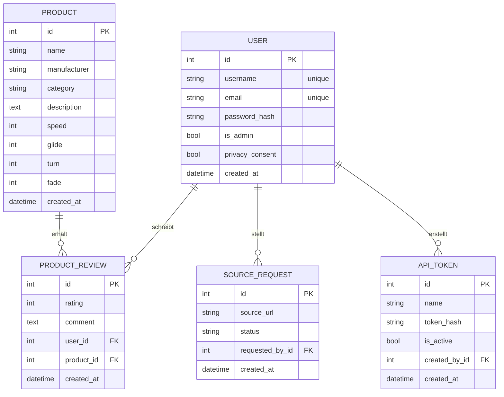
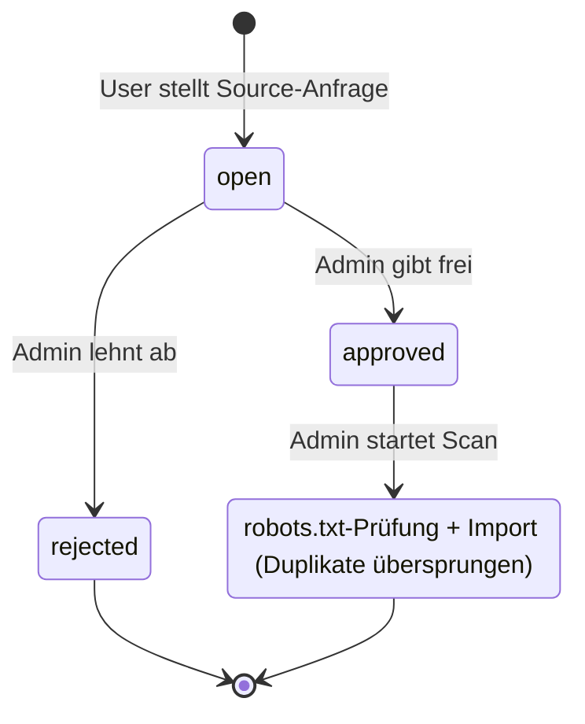
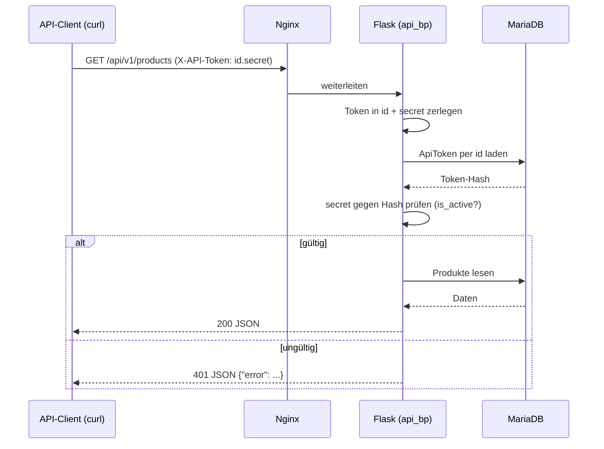
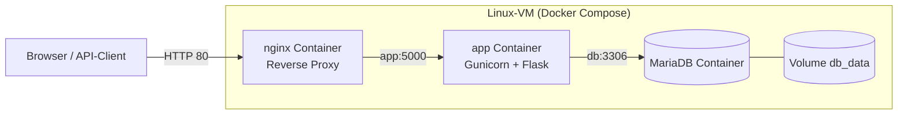

# Praxisarbeit DBWE.TA1A.PA – FlightDeck DG Hub

**Modul:** DBWE.TA1A.PA – Datenbanken und Webentwicklung
**Studiengang:** HFINFA / HFINFP, 3. Studienjahr
**Verfasser:** Max Mustermann _(Filler – bitte ersetzen)_
**Examinator:** _<Name eintragen>_
**Abgabedatum:** 30.06.2026 _(Filler – bitte ersetzen)_

**Fach:** Datenbanken und Webentwicklung (DBWE)
**Anwendung:** FlightDeck DG Hub – Disc-Golf-Wissensplattform
**Technologien:** Python 3.12, Flask, MariaDB, Gunicorn, Nginx, Docker Compose
**Repository:** https://github.com/harpf/FlightDeck-DG-Hub
**Live-URL:** https://lab10.ifalabs.org _(HTTPS/443; self-signed Zertifikat, siehe Anhang / `docs/DEPLOYMENT.md`)_

> Dieses Dokument ist als Markdown verfasst und kann mit `pandoc` o. ä. nach PDF
> konvertiert werden (Mermaid-Diagramme werden z. B. von Typora, VS Code oder
> `pandoc` mit `mermaid-filter` gerendert). Siehe `docs/README.md`.

---

## 1 Management Summary

FlightDeck DG Hub ist eine Webanwendung, mit der eine Disc-Golf-Community
Ausrüstung (Discs, Bags, Körbe, Zubehör) gemeinsam erfassen, suchen und bewerten
kann. Benutzer registrieren sich mit Benutzername, E-Mail und Passwort, legen
Produkte mit den typischen Disc-Golf-Flugwerten (Speed, Glide, Turn, Fade) an
und bewerten sie. Zusätzlich können Benutzer **Quellen vorschlagen**, aus denen
ein Administrator nach Freigabe automatisiert Produktdaten importiert
(Web-Scraping unter Beachtung von `robots.txt`).

**Plattform / Infrastruktur:** Die Anwendung ist als containerisierte
3-Schichten-Architektur umgesetzt (Nginx → Gunicorn/Flask → MariaDB) und wird
per **Docker Compose** betrieben. Das Deployment erfolgt auf einer Linux-VM
(Google Cloud, `lab10.ifalabs.org`).

**Grösster Mehrwert:** Eine gemeinschaftlich gepflegte, durchsuchbare
Wissensbasis inklusive **maschinenlesbarem REST-API**, über das die Produktdaten
ohne Browser (z. B. per `curl`/Postman) abgerufen werden können.

**Grösstes Risiko:** Die automatisierte Datenübernahme aus Fremdquellen
(Scraping) ist rechtlich und technisch heikel; sie ist deshalb auf
**admin-freigegebene** Quellen begrenzt und prüft vorab die `robots.txt`.

**Was das Management wissen sollte:** Die Architektur ist bewusst einfach und
kostengünstig (ein Host, Open-Source-Stack, keine Lizenzkosten). Sie ist für
kleine bis mittlere Last ausgelegt; horizontale Skalierung ist vorbereitet,
aber noch nicht aktiviert (siehe Kapitel 7).

---

## 2 Anwendung

### 2.1 Wichtigste Anforderungen (Soll/Ist)

| # | Anforderung (Aufgabenstellung) | Umsetzung |
| - | --- | --- |
| A1 | Interaktive Weboberfläche (Eingabe, Aktion, Ergebnis) | Produktliste mit Suche/Filter, Produkterfassung, Bewertungen, Source-Anfragen |
| A2 | Benutzerkonten mit Passwort, Registrierung mit eindeutigem Benutzernamen + E-Mail | `auth`-Blueprint, `User`-Modell mit `unique`-Constraints, Passwort-Hash |
| A3 | Applikationsspezifische Daten in relationaler DB | `Product`, `ProductReview`, `SourceRequest`, `ApiToken` in MariaDB |
| A4 | Eigene Geschäftslogik | Suche/Filter, Review-Upsert, Source-Scanning mit robots.txt-Prüfung |
| A5 | Lesender Zugriff über RESTful Web-API, Auth ohne Browser | `/api/v1/*` mit `X-API-Token`-Header |
| A6 | DB MySQL/MariaDB/PostgreSQL | MariaDB 11.4 |
| A7 | Python ≥ 3.9 | Python 3.12 (Container-Image) |
| A8 | Flask + Erweiterungen | Flask, Flask-SQLAlchemy, Flask-Login, Flask-WTF, Flask-Migrate |
| A9 | Gunicorn (ggf. mit Nginx) | Gunicorn hinter Nginx Reverse Proxy |
| A10 | Source Code auf GitHub | https://github.com/harpf/FlightDeck-DG-Hub |
| A11 | Tests dokumentiert | pytest-Suite (26 Tests) + Testprotokoll (Kap. 2.6) |

### 2.2 Funktionalität und Bedienung (User Manual)

**Rollen**

- **Anonym:** Produkte ansehen, suchen und filtern.
- **User (registriert):** zusätzlich Produkte anlegen, Produkte bewerten,
  Source-Anfragen senden.
- **Admin:** zusätzlich Source-Anfragen moderieren (freigeben/ablehnen), Quellen
  scannen, API-Tokens verwalten.

**Typische Abläufe**

1. **Registrieren:** Navbar → *Registrieren* → Benutzername, E-Mail, Passwort
   (min. 10 Zeichen), Datenschutz-Einwilligung → Absenden.
2. **Anmelden:** Navbar → *Login*.
3. **Produkte suchen/filtern:** Startseite – Freitextsuche (Name/Hersteller) und
   Kategorie-Filter.
4. **Produkt anlegen:** *Produkt anlegen* → Felder inkl. Flugwerte (Speed 1–15,
   Glide 1–8, Turn −6…2, Fade 0–6) → Speichern.
5. **Bewerten:** Produktdetailseite → Bewertung (1–5) + Kommentar. Pro Benutzer
   und Produkt ist genau **eine** Bewertung möglich (weitere überschreiben sie).
6. **Source anfragen:** *Source anfragen* → URL + Notiz. Der Admin sieht die
   Anfrage im Dashboard.
7. **Admin-Dashboard (`/admin`):** Source-Anfragen freigeben/ablehnen,
   freigegebene Quelle scannen, API-Tokens erstellen/deaktivieren.

### 2.3 API-Schnittstelle

Lesendes REST-API für ausgewählte Anwendungsdaten. Authentifizierung über einen
**statischen API-Token** im Header `X-API-Token: <id>.<secret>` (von einem Admin
im Dashboard erstellt). Kein Browser/Session nötig.

| Methode | Endpunkt | Auth | Beschreibung |
| --- | --- | --- | --- |
| `GET` | `/api/v1/health` | – | Liveness-Check |
| `GET` | `/api/v1/products` | Token | Produktliste (`?q=`, `?category=`) |
| `GET` | `/api/v1/products/<id>` | Token | Einzelprodukt inkl. Reviews |
| `GET` | `/api/v1/full` | Token | Vollexport (Produkte + Reviews + Source-Requests) |

Beispiele (bei self-signed Zertifikat `curl -k` verwenden):

```
curl -k https://lab10.ifalabs.org/api/v1/health
curl -k -H "X-API-Token: 3.kJ8..." https://lab10.ifalabs.org/api/v1/products
curl -k -H "X-API-Token: 3.kJ8..." "https://lab10.ifalabs.org/api/v1/products?q=destroyer"
curl -k -H "X-API-Token: 3.kJ8..." https://lab10.ifalabs.org/api/v1/products/1
```

Fehlerfälle: fehlender/ungültiger Token → `401`; unbekanntes Produkt → `404`
(jeweils als JSON). Details: `scripts/API_Readme.md`.

### 2.4 Architektur

#### 2.4.1 Datenmodell (ERD)



Kurzbeschreibung: Ein **User** kann viele **ProductReviews**, **SourceRequests**
und **ApiTokens** besitzen. Ein **Product** hat viele **ProductReviews**. Die
Kombination (`user_id`, `product_id`) in `ProductReview` ist über einen
`UniqueConstraint` eindeutig (eine Bewertung pro Benutzer/Produkt). Passwörter
und API-Secrets werden ausschliesslich als Hash gespeichert.

#### 2.4.2 Wichtigster Ablauf: Source-Anfrage → Scan (Zustandsdiagramm)



Nur **freigegebene** Quellen dürfen gescannt werden. Vor dem Abruf wird die
`robots.txt` der Zielseite geprüft (`is_scraping_allowed`). Produkte werden aus
`application/ld+json`-`Product`-Markup extrahiert; bereits vorhandene Einträge
(gleicher Name + Hersteller) werden übersprungen.

#### 2.4.3 API-Authentifizierung (Sequenzdiagramm)



#### 2.4.4 Bereitstellung (Deployment-Diagramm)



Drei Container (`nginx`, `app`, `db`) in einem Docker-Compose-Netz. Nur Nginx
veröffentlicht einen Port nach aussen (80; optional 443 für TLS). Der
Anwendungszustand liegt ausschliesslich im Volume `db_data`.

### 2.5 Zusätzlich verwendete Technologien (mit Quellen)

| Technologie | Zweck | Quelle |
| --- | --- | --- |
| Docker / Docker Compose | Containerisierung, reproduzierbares Deployment | https://docs.docker.com/compose/ |
| Bootstrap 5 | Frontend-Styling (CDN) | https://getbootstrap.com/ |
| Standardbibliothek `urllib.robotparser` | robots.txt-Prüfung beim Scanning | https://docs.python.org/3/library/urllib.robotparser.html |
| `application/ld+json` (Schema.org Product) | strukturierte Produktdaten beim Import | https://schema.org/Product |

Begründung Docker (über den Unterricht hinaus): einheitliche Laufzeitumgebung
für app/db/nginx, einfache Bereitstellung auf der Lab-VM, klare Trennung der
Komponenten. Vorteil: Reproduzierbarkeit; Nachteil: zusätzliche Abstraktions-
und Betriebsebene.

### 2.6 Testprotokoll

Automatisierte Tests: `pytest` (26 Tests, alle grün). Ausführung:
`pip install -r requirements-dev.txt && pytest`.

| # | Testfall | Erwartetes Ergebnis | Tatsächliches Ergebnis | Art |
| - | --- | --- | --- | --- |
| T1 | Registrierung mit gültigen Daten | User wird angelegt, Redirect zu Login | wie erwartet | auto (`test_register_creates_user`) |
| T2 | Registrierung mit bereits vergebenem Benutzernamen | kein zweiter Account | wie erwartet | auto (`test_register_rejects_duplicate_username`) |
| T3 | Registrierung ohne Datenschutz-Einwilligung | Account wird **nicht** angelegt | wie erwartet | auto (`test_register_requires_privacy_consent`) |
| T4 | Login mit falschem Passwort | Fehlermeldung „Ungültige Zugangsdaten“ | wie erwartet | auto (`test_login_fails_with_wrong_password`) |
| T5 | Produkt anlegen ohne Login | Redirect zu `/auth/login` | wie erwartet | auto (`test_create_product_requires_login`) |
| T6 | Startseite zeigt angelegtes Produkt | Produktname sichtbar | wie erwartet | auto (`test_home_lists_products`) |
| T7 | Suche grenzt Produkte ein | Nicht-Treffer wird nicht angezeigt | wie erwartet | auto (`test_home_search_filters_products`) |
| T8 | Security-Header gesetzt | `X-Frame-Options`, CSP etc. vorhanden | wie erwartet | auto (`test_security_headers_present`) |
| T9 | API ohne Token | HTTP 401 | wie erwartet | auto (`test_products_requires_token`) |
| T10 | API mit gültigem Token | HTTP 200 + Produktliste | wie erwartet | auto (`test_products_list_with_token`) |
| T11 | API: deaktivierter Token abgelehnt | HTTP 401 | wie erwartet | auto (`test_deactivated_token_is_rejected`) |
| T12 | API: unbekanntes Produkt | HTTP 404 (JSON) | wie erwartet | auto (`test_product_detail_404`) |
| T13 | robots.txt verbietet Scan | Quelle wird nicht gescannt | wie erwartet | auto (`test_is_scraping_allowed_respects_parser`) |
| T14 | End-to-End API gegen Live-Deployment | health 200, ohne Token 401, mit Token 200 | _bei Deployment auszuführen_ | manuell (`scripts/test_api_login.sh`) |

Hinweis gemäss Aufgabenstellung: Es kommt nicht darauf an, dass alle Tests
erfolgreich sind, sondern dass sie definiert und durchgeführt wurden. T14 ist
erst nach erfolgtem Deployment auf der Lab-VM ausführbar.

---

## 3 Reflexion: Wartbarkeit, Skalierbarkeit, Verfügbarkeit

**Wartbarkeit.** Die App ist in Flask-Blueprints (`main`, `auth`, `products`,
`admin`, `api`) getrennt; Datenzugriff erfolgt über das SQLAlchemy-ORM statt
über Roh-SQL. Die JSON-Ausgabe des API ist in zentralen Serializern gebündelt
(eine Stelle pro Datenform → keine Drift). Automatisierte Tests sichern die
Kernfunktionen ab. *Vorteil:* schnelle, sichere Änderungen. *Nachteil:* das ORM
verdeckt teils das tatsächliche SQL; bei Performance-Themen ist `EXPLAIN`-
Analyse nötig.

**Skalierbarkeit.** Kurzfristig vertikal (mehr Gunicorn-Worker/Threads, mehr
DB-Ressourcen). Mittelfristig horizontal: Der `app`-Container ist zustandslos
und kann hinter Nginx repliziert werden; die Sessions müssten dann serverseitig
(z. B. Redis) ausgelagert werden. *Vorteil:* klarer Pfad ohne Architektur-
Bruch. *Nachteil:* horizontale Skalierung ist vorbereitet, aber noch nicht
aktiv (Session-Store, Load-Balancer fehlen).

**Verfügbarkeit.** Alle Container laufen mit `restart: unless-stopped`; der
Zustand liegt ausschliesslich im Volume `db_data`, sodass App-Container ohne
Datenverlust ersetzt werden können. Ein öffentlicher Health-Endpoint
(`/api/v1/health`) ermöglicht Monitoring. *Nachteil:* Single-Host ohne
Redundanz; fällt die VM aus, ist der Dienst offline. Für höhere Verfügbarkeit
wären mehrere Hosts, ein externer DB-Dienst und Healthchecks/Alerting nötig
(siehe `docs/ARCHITEKTUR.md`, Roadmap).

---

## Anhang

- **Repository:** https://github.com/harpf/FlightDeck-DG-Hub (lesender Zugriff)
- **Live-URL:** https://lab10.ifalabs.org
- **Admin-Login:** Benutzer `admin`, Passwort `ChangeMe123!` _(Filler – beim
  Deployment generiert/gesetzt über `BOOTSTRAP_ADMIN_PASSWORD`, sichere Übergabe
  an Examinator)_
- **API-Token (Beispiel):** `3.kJ8s2_FILLER_secret_xyz` _(im Admin-Dashboard
  erzeugen, siehe Kap. 2.3)_
- **Architektur-Detail:** `docs/ARCHITEKTUR.md`
- **Deployment:** `docs/DEPLOYMENT.md`
- **API-Doku:** `scripts/API_Readme.md`

